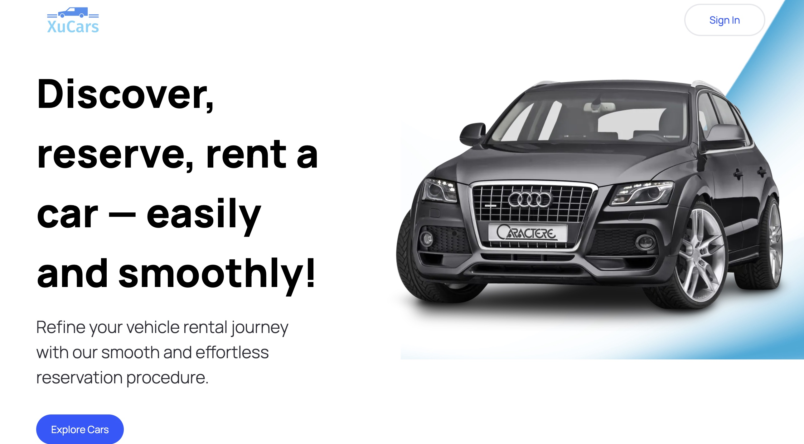
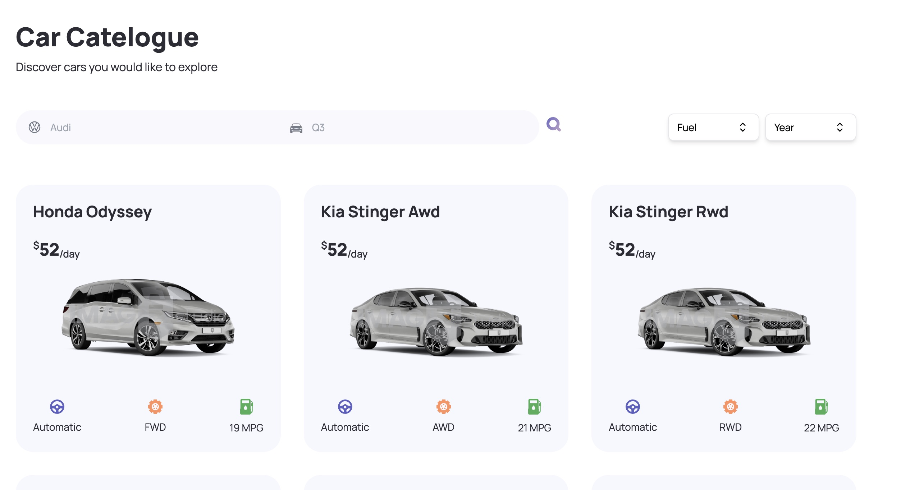
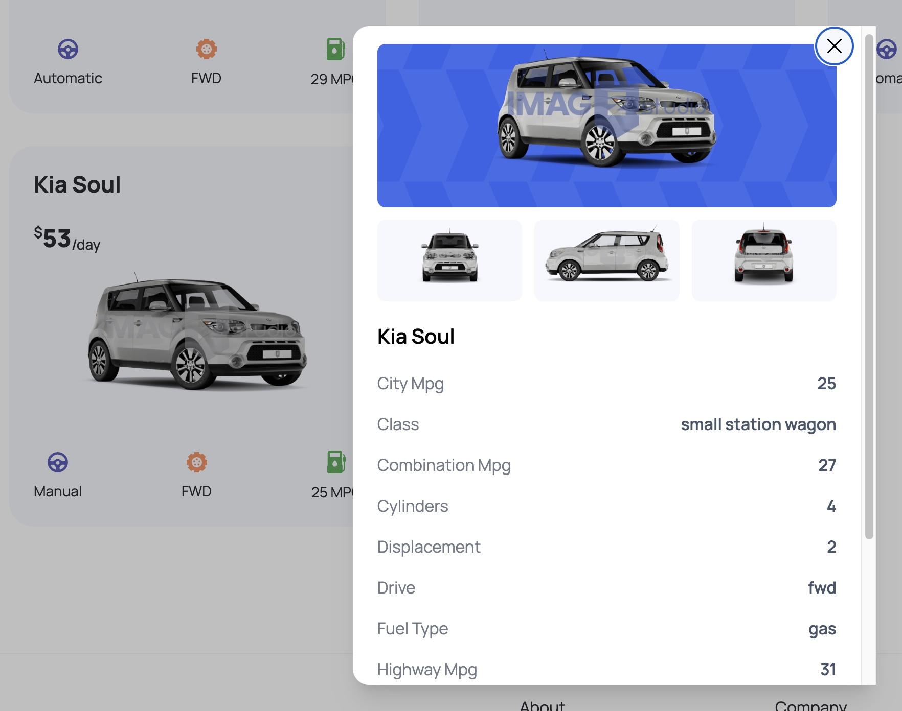

<!-- PROJECT LOGO -->
 

  
<!--  <a href="https://sbodify.netlify.app/">
    <h1 align="center">Spodify</h1>
  </a>-->
  <h3 align="center">
   A modern car rental showcase that allows you to explore your favorite cars
  </h3>

   

<!-- ABOUT THE PROJECT -->
## About The Project

**[XuCars](https://xu-cars-hub.vercel.app/)** is an modern car rental application that allows you to explore your favorite cars based on make, model, fuel-type, year, etc.

### Key Features
  - **Discovery**: Discover most trending cars in the marketand also allow users to search their preferred cars based on make and model.
  - **Car Detail Card**: Users can see detailed information about their preferred cars, such as number of cylinders, city/combination mpg, drive type, etc.
  - **Advanced filtering**: Users can filter their potential candidates by different criteria such as fuel-type, year, etc. 
  - **Optimzation for Search Engine**: achieve server-side rendering by utilizing NextJs 13.4, which could improve the result of SEO.

   &emsp14;&emsp14;&emsp14;&emsp14;
  &emsp14;&emsp14;&emsp14;&emsp14;&emsp14;&emsp14;&emsp14;&emsp14;
  

### Built With

*  Typescript
*  NextJs
*  TailwindCSS
*  Rapid API
